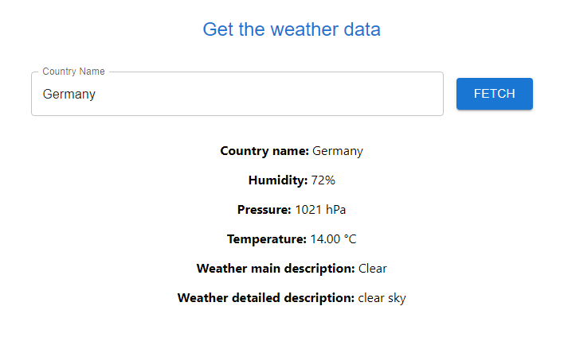

# Weather App

## Overview

The Weather App is a simple application that retrieves current weather information for a given country using the OpenWeatherMap API. Users can input a country name, and the app will display relevant weather data such as humidity, pressure, temperature, and weather descriptions.

## Getting Started

### Prerequisites

- Node.js installed
- API key from [OpenWeatherMap](https://openweathermap.org/api) (replace `APPID` in the .env with your actual API key)

### Installation

1. Clone the repository:

   ```bash
   git clone https://github.com/Achraf-haddar/Weather-App.git
   ```

2. Install dependencies:  
    `cd backend &&
    npm install`
   `cd frontend &&
    npm install`
3. Run the application:
   Inside backend folder: `node app.js`
   Inside frontend folder: `npm start`

   The app will be accessible at `http://localhost:3000` by default.

## Some Screenshots:



## GitHub Actions Pipeline

This repository is configured with a GitHub Actions pipeline that automates the build and deployment process. The pipeline is triggered on each push to the `master` branch. The pipeline consists of two jobs: "Build Image."

The "Build Image" job runs on an Ubuntu environment and performs the following steps:

1.  **Check out code:** The repository code is checked out using the `actions/checkout` action.
2.  **Configure AWS credentials:** AWS credentials are configured using the `aws-actions/configure-aws-credentials` action, allowing secure access to AWS services.
3.  **Login to Amazon ECR:** The pipeline logs in to Amazon Elastic Container Registry (ECR) using the `aws-actions/amazon-ecr-login` action.
4.  **Build, tag, and push backend image:** The backend Docker image is built from the `backend/` directory, tagged, and pushed to the specified Amazon ECR repository.
5.  **Build, tag, and push frontend image:** Similarly, the frontend Docker image is built from the `frontend/` directory, tagged, and pushed to the same Amazon ECR repository.

This GitHub Actions pipeline facilitates continuous integration and deployment, ensuring that changes pushed to the `master` branch are automatically built and deployed to the specified Amazon ECR repository.
